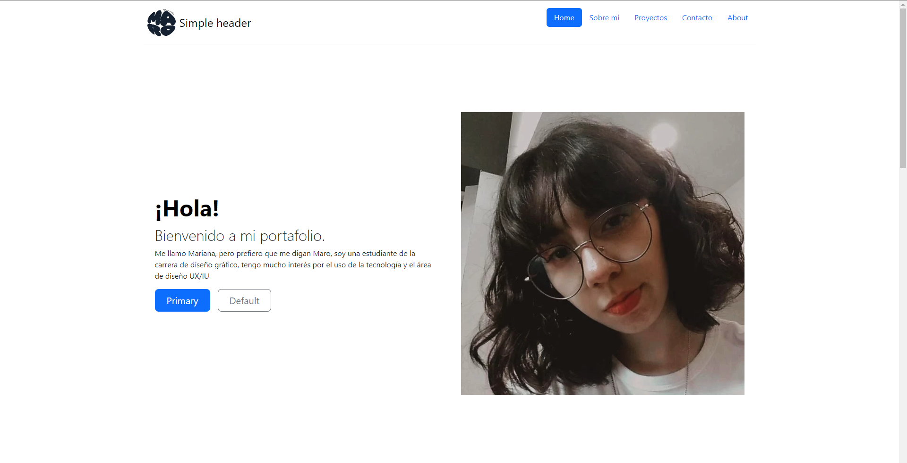

# Portafolio personal: Tecnolochicas PRO 

Este proyecto fue creado durante el bootcamp Tecnolochicas PRO, es una página web responsive (adaptable a diversos dispositivos)

El proposioto de la creación de este sitio web se mostrara el portafolio de la desarrolladora y su experiencia alrededor del área. 

Incluye las secciónes: sobre mí, proyectos, experiencias. 

Incluye recursos multimedia

## Índice 
 1. Intro
 2. Secciones
 3. ¿Qué construímos? 
 4. Objetivos del aprendizaje 

## Intro 
Bienvenido a mi portafolio, en este proyecto nos centramos en la elaboración de un portafolio atractivo que permitirá conocer un poco sobre las habilidades que tengo actualmente, las secciones principales se pueden dividir en 3: Sobre mí, proyectos y contacto. 

### Secciones (Captura de pantalla)
Sobre mi

Proyectos

Contacto y footer con redes sociales. 

### Tecnologias 
 - CSS
 - HTML
 - JS 

## ¿Que construimos?
Con aún página principalmente de HTML con ayuda de bootstrap, para generar un estilo visual sencillo y con animaciones o funciones interactivas que llamen la atención de los usuarios, además de ser una página responsiva casi al 100%

## Objetivos de aprendizaje
Obtener un manejo entre basico a medio de las tecnologias utilizadas ademas de el uso de bootstrap. 

## Contacto 
Si estas interesado en compartir o concectar para algun proyecto u oportunidad laborar, contactame. 

